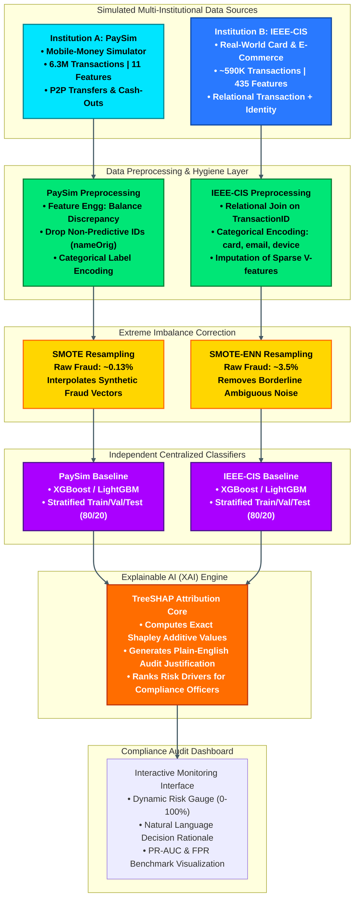
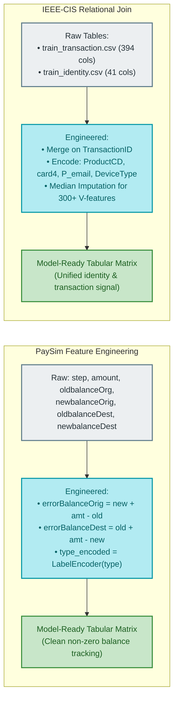
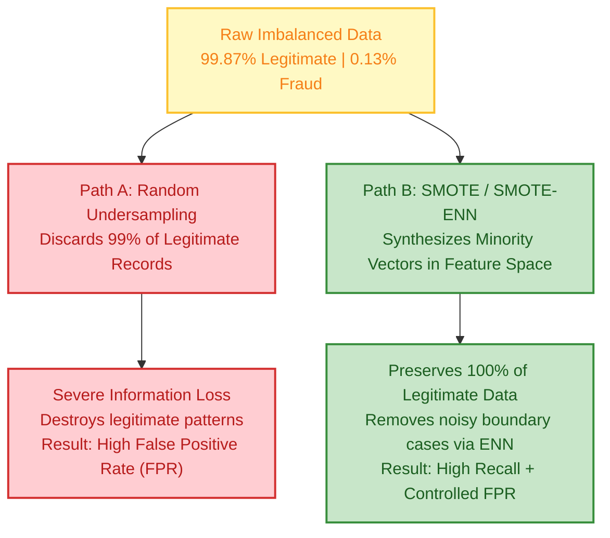
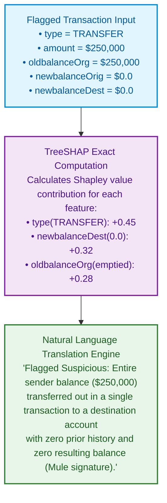
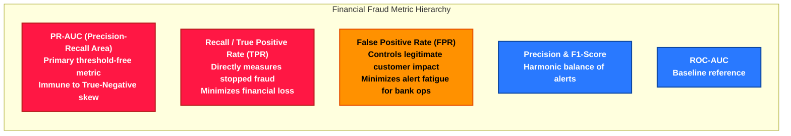
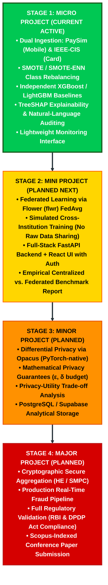

# FedGuard — Conceptual System Architecture and Technical Design

> **Document Scope:** Detailed architectural specification for the **Micro Project** stage of FedGuard, including multi-institution data ingestion, class-imbalance correction, centralized model formulation, and Explainable AI (SHAP) decision auditing. Future federated stages are summarized at the end.

---

## 1. End-to-End Micro Pipeline Flowchart

The following diagram illustrates the complete architectural workflow of the **Micro Project**:

---

## 2. Data Transformation and Preprocessing Mechanics

---

## 3. Class Imbalance Strategy: SMOTE vs. Random Undersampling

In banking fraud, non-fraud transactions constitute over **99%** of observations. The architecture applies **SMOTE (Synthetic Minority Over-sampling Technique)** and **SMOTE-ENN**:

---

## 4. TreeSHAP Explainability Mechanism

Standard black-box ML models output only a probability score (e.g. `0.94`), which fails regulatory compliance under **RBI Directions** and the **DPDP Act (2023)**. FedGuard's XAI layer translates model decisions into audit-ready explanations:

---

## 5. Evaluation Framework Architecture

---

## 6. Full Four-Stage Scope Boundary

FedGuard progresses through four clearly demarcated academic phases:

