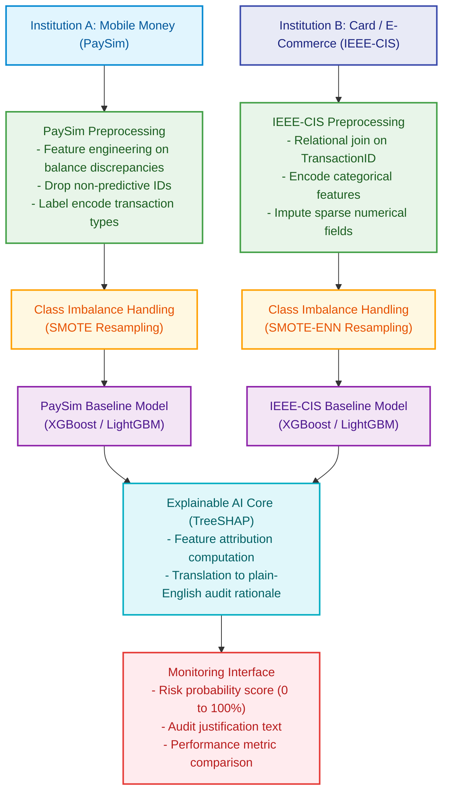
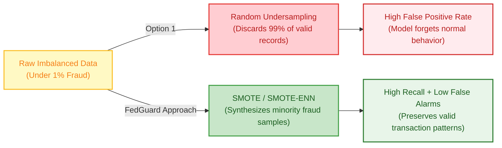
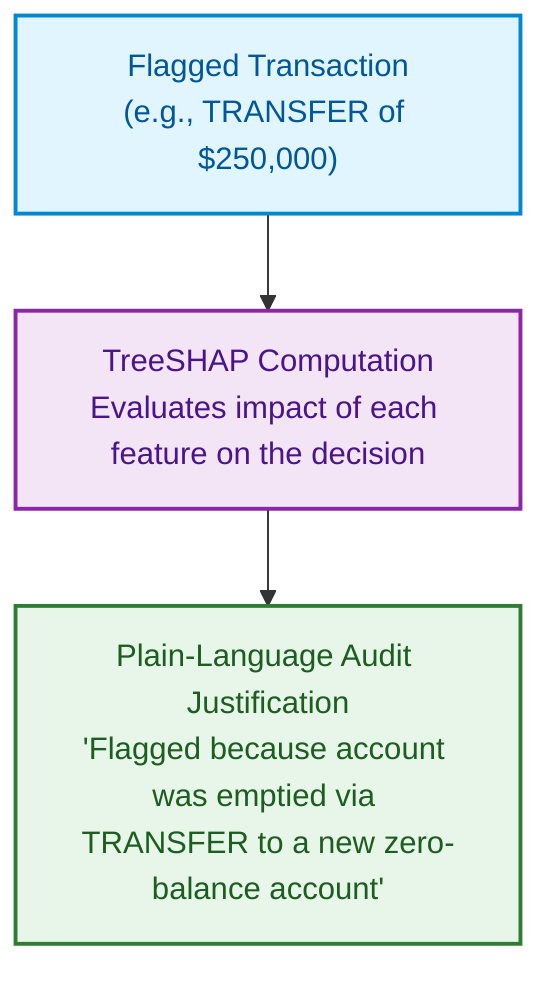
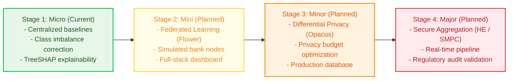

# FedGuard — System Architecture

This document details the technical architecture, data processing stages, and design decisions for the **Micro Project** phase of FedGuard.

---

## 1. System Pipeline Overview

The Micro Project establishes a centralized machine learning and explainability pipeline across two heterogeneous financial datasets:

---

## 2. Data Processing and Feature Engineering

### Dataset Specifications

| Dataset | Institution Type | Volume | Key Engineered Signals |
|---|:---:|:---:|---|
|  | Mobile Money (P2P) | ~6.3M rows | `errorBalanceOrig`, `errorBalanceDest`, transaction type encoding |
|  | Card / E-Commerce Gateway | ~590K rows | Relational join on `TransactionID`, device OS, email risk |

### PaySim (Mobile Money)
- **Characteristics:** Agent-based simulation based on real mobile money transaction logs (~6.3 million rows, 11 columns).
- **Engineered Features:** 
  - `errorBalanceOrig`: tracks discrepancy between origin account initial balance, transfer amount, and resulting balance.
  - `errorBalanceDest`: tracks discrepancy on the destination account.
- **Categorical Handling:** Encodes `type` (`TRANSFER`, `CASH_OUT`, `PAYMENT`, `DEBIT`, `CASH_IN`). Drops identifier strings (`nameOrig`, `nameDest`).

### IEEE-CIS (Card / E-Commerce)
- **Characteristics:** Real-world payment gateway records provided by Vesta Corp (~590,000 transactions, 435 combined features).
- **Relational Merging:** Joins `train_transaction.csv` with `train_identity.csv` using `TransactionID`.
- **Categorical Handling:** Encodes payment product codes, card network attributes (`card1` to `card6`), email domains, and device fingerprints.
- **Missing Value Imputation:** Imputes missing entries across numerical and behavioral columns.

---

## 3. Class Imbalance Handling

Financial fraud accounts for less than 1% of transactions (approximately 0.13% in PaySim, 3.5% in IEEE-CIS).

Rather than discarding legitimate transactions through random undersampling, the pipeline applies:
- **SMOTE:** Synthesizes new fraud instances by interpolating between nearest neighbors of known fraud transactions.
- **SMOTE-ENN:** Follows SMOTE with Edited Nearest Neighbors to prune noisy samples along the decision boundary.

---

## 4. TreeSHAP Decision Explainability

Standard gradient-boosted trees output a raw probability score, which provides no justification to human risk officers. FedGuard integrates TreeSHAP to compute exact Shapley feature attributions:

This ensures every flagged decision complies with audit and transparency requirements under RBI guidelines and data protection regulations.

---

## 5. Evaluation Strategy

Because fraud datasets are severely skewed, traditional accuracy is uninformative. The system is evaluated using the following operational hierarchy:

| Metric | Priority | Operational Significance |
|---|:---:|---|
| **PR-AUC (Precision-Recall AUC)** |  | Immune to true-negative inflation; the definitive measure for extreme class imbalance |
| **Recall (True Positive Rate)** |  | Quantifies the direct volume of fraudulent capital prevented from escaping |
| **False Positive Rate (FPR)** |  | Minimizes legitimate customer friction and reduces operational alert fatigue |
| **Precision & F1-Score** |  | Harmonic balance between alert volume and detection accuracy |
| **ROC-AUC** |  | Threshold-independent discrimination baseline for literature comparison |

---

## 6. Multi-Stage Scope Progression

