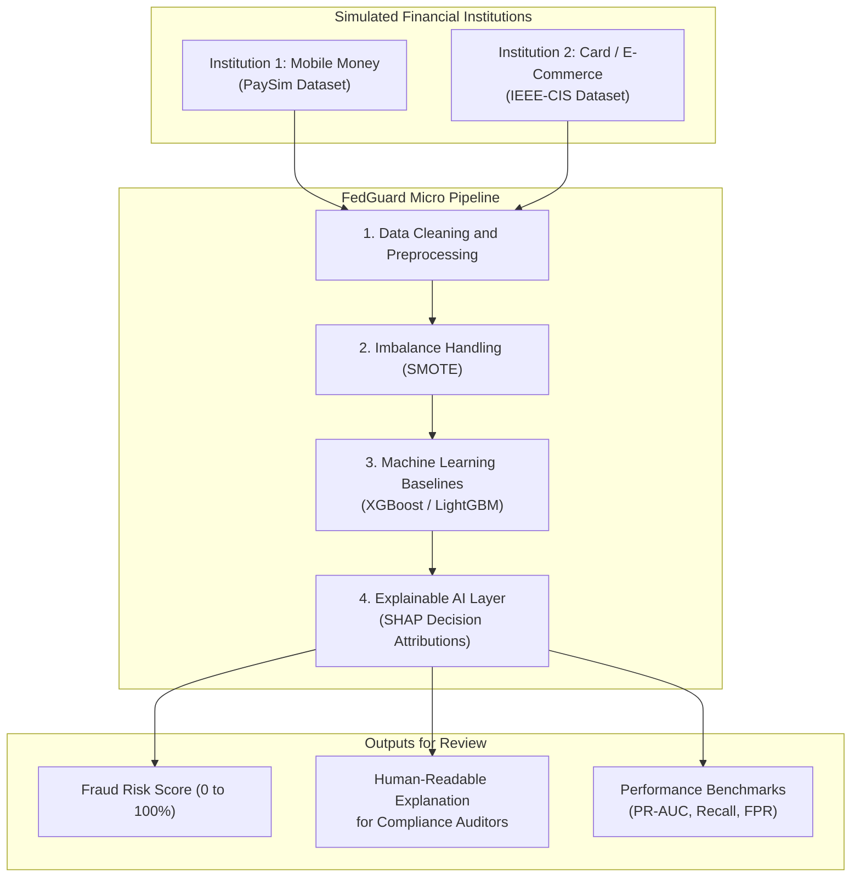

# FedGuard

### Privacy-Preserving Financial Fraud Detection Using Machine Learning and Explainable AI

---

## 1. Project Idea and Motivation

Financial fraud schemes—especially money-laundering "mule" networks—routinely operate across multiple banks and payment processors. Because each financial institution only monitors its own transactions, no single bank has full visibility into the fraud chain.

At the same time, privacy regulations (such as Reserve Bank of India directions, the Digital Personal Data Protection Act 2023, and GDPR) strictly prohibit banks from pooling raw customer transaction records.

**FedGuard** addresses this challenge in stages. While the long-term vision incorporates Federated Learning across institutions, the **Micro Project** establishes the foundational machine learning and explainability layer.

---

## 2. Micro Project Overview

In the Micro Project, we simulate two distinct financial institutions using public, human-readable datasets:
- **Institution 1 (Mobile Money):** Simulated using the **PaySim** dataset (peer-to-peer transfers and cash-out operations).
- **Institution 2 (Card / E-Commerce):** Simulated using the **IEEE-CIS** dataset (card transactions, identity attributes, and device info).

The diagram below illustrates how transactions flow through the Micro Project pipeline:



---

## 3. Why These Datasets?

Many academic papers rely on the Kaggle European Credit Card dataset. However, that dataset anonymizes all feature names into mathematical principal components (`V1` through `V28`). 

If a model flags a transaction and explains it as `"V14 was -4.2"`, a compliance officer cannot understand or defend that flag in an audit.

FedGuard deliberately uses **PaySim** and **IEEE-CIS** because they retain real, human-readable attributes:
- **PaySim:** Account balances, transaction types (`TRANSFER`, `CASH_OUT`), and amount shifts.
- **IEEE-CIS:** Card networks, transaction amounts, email domains, and device types.

This allows the **SHAP** explainability layer to generate clear, plain-language audit trails (e.g., *"Entire sender balance transferred out to an account with zero prior history"*).

---

## 4. Multi-Stage Roadmap

The project is structured across four academic stages, with **Micro** as the current active foundation:

| Stage | Focus | What Is Built |
|---|---|---|
| **Micro (Current)** | Centralized Baselines & Explainability | Data cleaning, SMOTE, XGBoost/LightGBM baselines, and SHAP decision explanations |
| **Mini (Planned)** | Federated Learning | Cross-institution collaborative training using Flower (FedAvg) without sharing raw records |
| **Minor (Planned)** | Differential Privacy | Privacy budget constraints (epsilon, delta) applied via Opacus to protect model updates |
| **Major (Planned)** | Secure Aggregation | Cryptographic protection (HE / SMPC) so the central server never sees plaintext updates |

For complete technical specifications and data flow mechanics, refer to [ARCHITECTURE.md](ARCHITECTURE.md).

---

## 5. Repository Structure

```
FedGuard/
├── README.md             # Project idea, overview, and roadmap
├── ARCHITECTURE.md       # Technical system flow and design details
├── requirements.txt      # List of dependencies
├── .gitignore            # Git rules excluding datasets and local documents
├── data/
│   ├── README.md         # Dataset descriptions and download instructions
│   ├── raw/              # Stored dataset CSVs (excluded from Git)
│   └── processed/        # Preprocessed data directory
└── docs/                 # Project documentation and review materials
```

---

## Academic and Team Details

- **Project Title:** Privacy-Preserving Multi-Institutional Financial Fraud Detection Using Federated Learning and Explainable AI
- **College:** Bharati Vidyapeeth's College of Engineering, New Delhi
- **Department:** Department of Computer Science and Engineering
- **Mentor:** Prof. Mohit Tiwari, Assistant Professor
- **Team Members:**
  - Naman Dugar (05911502724)
  - Anvi Tyagi (00211502724)
  - Riyanshu (05711502724)
