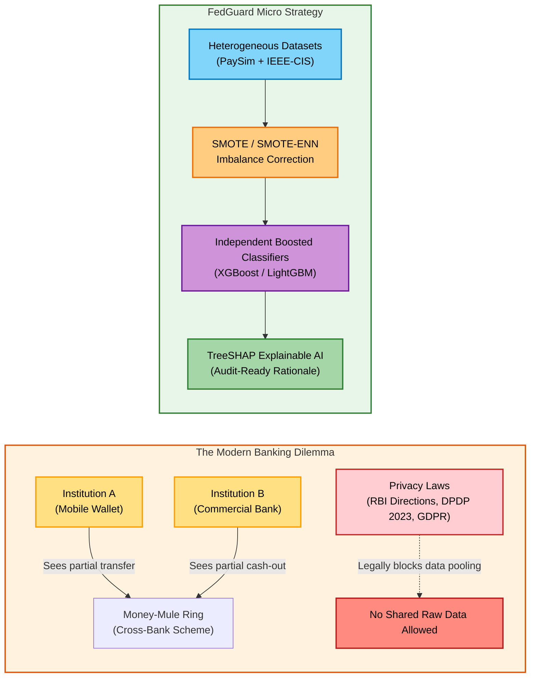
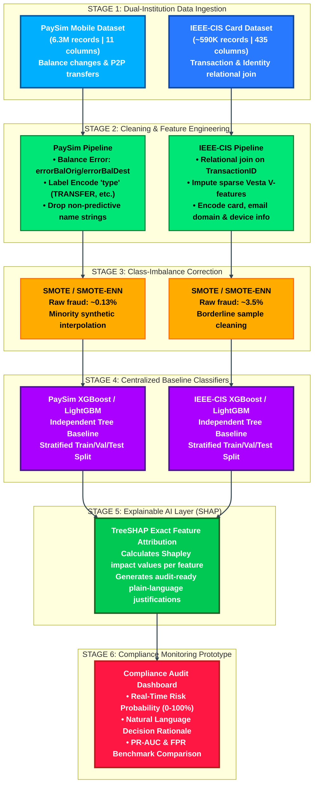
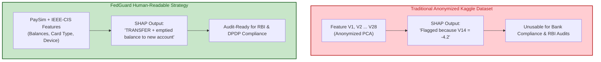
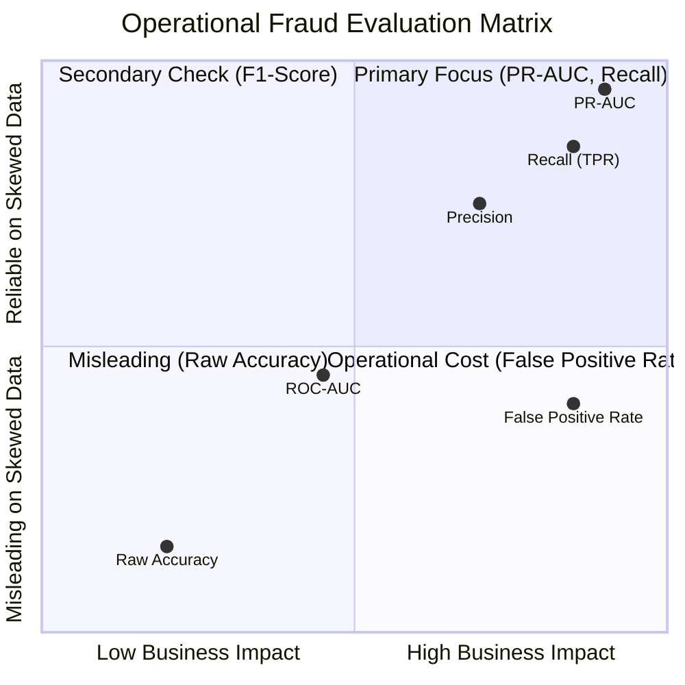
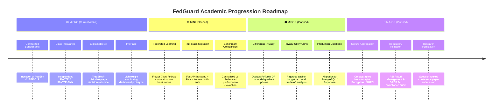

# FedGuard: Banking Fraud Detection System
### Privacy-Preserving Multi-Institutional Financial Fraud Detection Using Machine Learning and Explainable AI

<p align="center">
  
  
  
  
</p>

---

## 1. Project Overview and Core Idea

Digital banking and instant payment systems have expanded exponentially. Concurrently, organized fraud rings execute coordinated multi-hop transactions (such as money-mule networks) across **multiple independent banks and payment processors**. 

Because each financial institution only observes its own siloed records, no single bank captures the global fraud pattern.



> [!IMPORTANT]
> **Current Submission Scope:** This repository covers the foundational **MICRO PROJECT** — establishing empirical centralized baselines, resolving extreme class imbalance, and integrating human-readable SHAP explanations ahead of future federated learning extensions.

---

## 2. Micro Project Workflow Architecture

The flowchart below details the end-to-end data pipeline, modeling, and explainability layer planned for the **Micro Project**:



---

## 3. Dataset Strategy: Why Standard PCA Datasets Fail

During review evaluations, examiners frequently ask:
> *"Why not use the popular Kaggle European Credit Card dataset?"*



### Institutional Simulation Breakdown
| Institution Simulated | Dataset Selected | Characteristics | Role in Micro Pipeline |
|----------------------|------------------|-----------------|------------------------|
| **Mobile Money Operator** | **PaySim** (471 MB) | Step, Amount, Old/New Balances, P2P Transfers | Evaluates account-drainage and mule cash-outs |
| **Card Network / Gateway** | **IEEE-CIS** (~677 MB) | Card Network, Email Domain, Device OS, TransactionAmt | Evaluates card-not-present and identity spoofing |

---

## 4. Specialized Fraud Evaluation Framework

Traditional machine learning relies on accuracy, but financial fraud is an **extreme needle-in-a-haystack problem** ($<1\%$ fraud). FedGuard's evaluation framework prioritizes:



* **PR-AUC (Precision-Recall Area Under Curve):** The decisive metric for highly imbalanced fraud datasets; completely immune to majority-class inflation.
* **Recall (True Positive Rate):** Measures the direct proportion of financial fraud detected.
* **False Positive Rate (FPR):** Controls operational overhead — preventing legitimate customer cards and transactions from being erroneously blocked.

---

## 5. Repository Structure

```
FedGuard/
├── README.md                           # Main project idea & Micro pipeline overview
├── ARCHITECTURE.md                     # In-depth architectural & data-flow specification
├── requirements.txt                    # Planned Python environment dependencies
├── .gitignore                          # Strict gitignore protecting repository from large data
├── data/
│   ├── README.md                       # Dataset overview and setup details
│   ├── raw/                            # Contains PaySim & IEEE-CIS CSVs (git-ignored)
│   ├── processed/                      # Cleaned & resampled datasets (git-ignored)
│   └── sample/                         # Placeholder for small demo batches
└── docs/                               # Project documentation & review materials
```

---

## 6. Full Four-Stage Project Roadmap

While our current deliverable is strictly the **Micro Project**, the full technical trajectory progresses across all four academic phases:



---

## Academic and Team Details

* **Project Title:** Privacy-Preserving Multi-Institutional Financial Fraud Detection Using Federated Learning and Explainable AI
* **Short Title:** FedGuard
* **College:** Bharati Vidyapeeth's College of Engineering, New Delhi
* **Department:** Department of Computer Science and Engineering
* **Project Mentor:** Prof. Mohit Tiwari, Assistant Professor, Dept. of CSE
* **Team Members:**
  * **Naman Dugar** (Enrollment No: 05911502724)
  * **Anvi Tyagi** (Enrollment No: 00211502724)
  * **Riyanshu** (Enrollment No: 05711502724)
